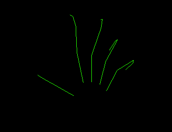

HelloLeap
=========

A simple program to visualize one hand skeleton: [Demo](http://youtu.be/NZuJxayxJvY)

Dependencies:
  * GLFW
  * GLEW
  * OpenGL 4.0+ compatible graphics card  
  * Leap Motion SDK 2.2
  * Mac OS X 10.9.4 (tested)

If you find it helpful, please feel free to let me know at wang.yu@umbc.edu.
